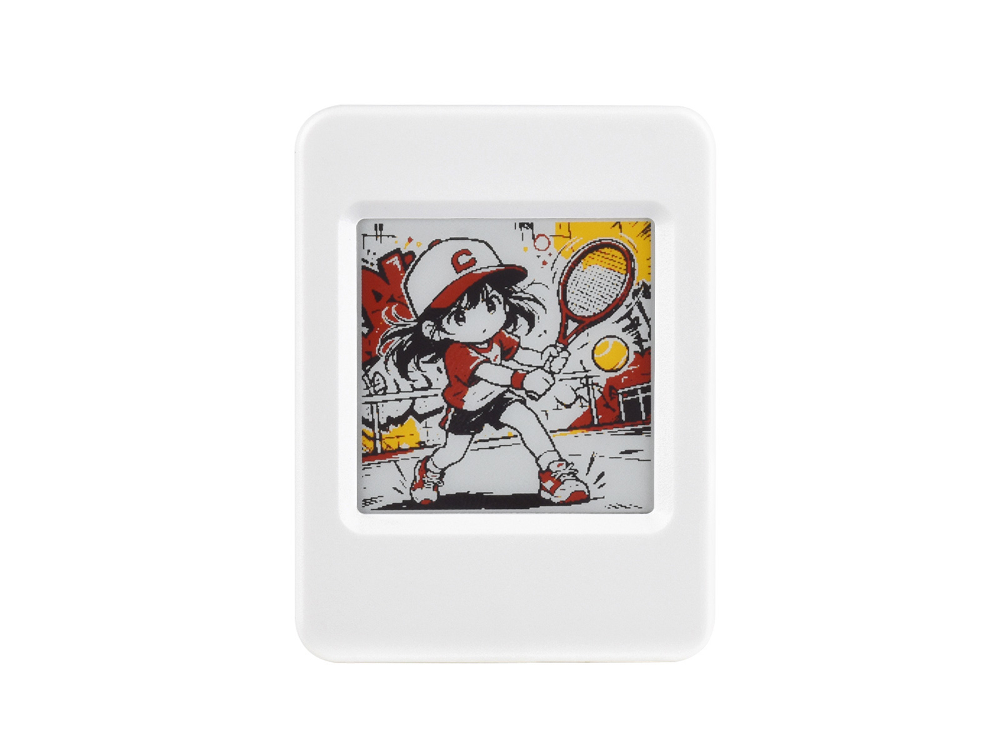

# Waveshare ESP32-S3-ePaper-1.54G

[English](README.md)

ESP32-S3-ePaper-1.54G 是微雪推出的一款墨水屏 AIoT 开发板，搭载 ESP32-S3-PICO-1-N8R8，采用最高 240 MHz 的双核 Xtensa LX7 处理器，集成 8 MB Flash 和 8 MB PSRAM，支持 2.4 GHz Wi-Fi 与 蓝牙 5 (LE)。板载 1.54 英寸 200 x 200 红、黄、黑、白四色电子墨水屏，并集成 ES8311 音频编解码芯片、麦克风、扬声器、SHTC3 温湿度传感器、PCF85063 RTC、Micro SD 卡槽、USB Type-C 接口及锂电池接口，适用于低功耗信息显示、环境监测、语音交互及其他物联网应用。

- [购买链接](https://www.waveshare.net/shop/ESP32-S3-ePaper-1.54G.htm)
- [产品文档](https://docs.waveshare.net/ESP32-S3-ePaper-1.54G/)



## 仓库结构

本仓库提供 ESP32-S3-ePaper-1.54G 的示例程序、出厂固件和硬件设计文件。

```text
.
|-- Example/
|   |-- Arduino_3.2.0/    # Arduino 示例程序及依赖库
|   |-- ESP-IDF_5.5.1/    # ESP-IDF 外设与墨水屏示例程序
|   `-- XiaoZhi/          # 小智 AI 语音示例及 SD 卡资源
|-- Firmware/             # 预编译出厂固件（.bin）
|-- Hardware/             # 硬件原理图（PDF）
|-- README.md             # 英文说明
`-- README_ZH.md          # 中文说明
```

## 板载资源

- ESP32-S3-PICO-1-N8R8，集成 8 MB Flash 和 8 MB PSRAM
- 1.54 英寸 200 x 200 SPI 电子墨水屏，支持红、黄、黑、白四色显示
- ES8311 音频编解码芯片、板载麦克风、扬声器及外接扬声器接口
- SHTC3 温湿度传感器
- PCF85063 实时时钟
- Micro SD 卡槽
- USB Type-C 接口，支持程序下载与串口日志
- 锂电池接口、充电电路、电池电压检测及电源按键
- 2 x 6PIN、2.54 mm 间距扩展排母

## 示例程序

[`Example/Arduino_3.2.0`](Example/Arduino_3.2.0) 和 [`Example/ESP-IDF_5.5.1`](Example/ESP-IDF_5.5.1) 目录包含电池 ADC 检测、PCF85063 RTC、SHTC3 温湿度传感器、Micro SD、Wi-Fi AP/STA、音频、电源控制和电子墨水屏等示例。

[`Example/XiaoZhi`](Example/XiaoZhi) 目录包含小智 AI 语音应用及其 SD 卡资源。

## 快速开始

预编译测试固件位于 [`Firmware/`](Firmware)。开发环境搭建、固件烧录、引脚定义、示例使用方法及产品规格请参阅[产品文档](https://docs.waveshare.net/ESP32-S3-ePaper-1.54G/)。

## 问题与支持

请创建 [Issue](https://github.com/waveshareteam/ESP32-S3-ePaper-1.54G/issues) 并提供详细信息，或联系微雪团队并提供订单号以获取技术支持。

---

感谢您使用微雪电子产品！
